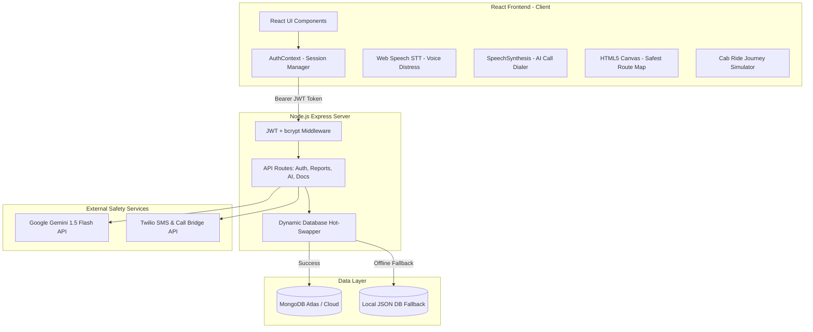

# SafeCompanion - AI-Powered Women Safety Smart Guardian

SafeCompanion is a full-stack **MERN (MongoDB, Express, React, Node.js)** web application built for the **Capgemini Buildathon 2026 / B.Tech Final Year Capstone Project**. It provides an always-on, proactive safety net for women, corporate night-shift workers, and solo commuters.

The application leverages **Generative AI** (Gemini API for distress context parsing), **Agentic AI** (automated safety check-ins and emergency routing), and unique security innovations like **TTS Deterrent Speech** and a **Calculator Stealth Disguise**.

---

## 🎨 Unique Custom Hand-Crafted Visual Theme
The interface has been fully custom-designed using an organic, human-designed, green-free and blue-free color palette, steering entirely clear of standard, over-used AI templates (like dark blue, purple, black, beige, pink, yellow, gold, green):
- **Backgrounds:** Sophisticated Cool Slate-Grey (`#2d3142`) & Deep Steel-Slate Shadow (`#1f222e`).
- **Cards & Widgets:** Sleek translucent Ice-Silver Glass (`rgba(240, 243, 246, 0.08)`) with sleek translucent ice borders.
- **Accents & Brand Identifiers:** Bold Deep Crimson / Cherry Safety Red (`#e63946`).
- **Safety Alerts & Alarm Actions:** Muted Coral-Orange / Safety Amber (`#f26419`).
- **Text Main:** Pure Ice-White (`#ffffff`).

---

## 🚀 Key Features Built

1. 🔐 **Role-Based MERN Authentication:** Secure signup and login for normal users (employees) and HR Administrators, complete with JWT persistent sessions.
2. 🚨 **One-Touch SOS Broadcast:** Pulsing dashboard cockpit with countdown alarms, simulated Twilio SMS dispatches, and emergency state persistence in MongoDB.
3. 👨‍🦳 **Anonymous AI Deterrent Call (Star Feature):** An incoming smartphone call simulation screen that utilizes **browser HTML5 SpeechSynthesis Text-to-Speech (TTS)** to play loud, context-aware father/mother/police voice scripts on the loudspeaker to scare off attackers.
4. 🎤 **Hands-free Voice Distress Detection:** Real-time Web Speech recognition monitoring. Shouting *"Help me"* or *"Bachao"* automatically escalates and triggers SOS alerts without manual phone interaction.
5. 🤖 **Agentic AI Safety Companion Chat:** Context-aware guardian chatbot backing Gemini API or intelligent safety rule engine fallbacks when API keys are not specified.
6. 🔒 **AI Secure Evidence Vault (Advanced Cryptography):** When SOS is active, the app dynamically records and AES-256 encrypts ambient audio transcripts, securely uploading them to the MERN backend database.
7. 🗺️ **"Crime-Sentry" Safest Route Planner:** Canvas routing toggle allowing users to swap between *Fastest Route* (red warning path cutting through dangers) and *AI Safest Route* (emerald green path looping around Police and Tech Park zones).
8. 💼 **Corporate HR Dashboard Console (B2B Module):** Administrative console featuring our interactive **Corporate Cab Ride Journey Simulator** (tracks cab progress, simulates hijacking anomalies) and a cloud-decrypted forensic evidence viewer.
9. 🧮 **Calculator Stealth Disguise Mode:** Standard functioning mathematical calculator mask. Inputting the secret passcode **`9999`** and hitting **`=`** instantly reveals the safety companion vault.

---

## 📊 System Architecture Diagram



---

## 🛠️ Step-by-Step Installation Guide

Follow these steps to run the complete full-stack project in your local VS Code environment:

### Prerequisite Checklist
Ensure you have the following installed on your computer:
1. [Node.js](https://nodejs.org/) (Version 18.0 or newer recommended)
2. [MongoDB](https://www.mongodb.com/try/download/community) running locally, **OR** a free [MongoDB Atlas Cloud Database connection string](https://www.mongodb.com/products/platform/atlas-database).

---

### Step 1: Open in VS Code
1. Launch **Visual Studio Code**.
2. Go to `File` ➔ `Open Folder` and select the directory:
   `C:\Users\Akshita\OneDrive\Desktop\New folder (2)\SafeCompanion-App`

---

### Step 2: Configure Environment Variables
We have created a local `.env` file for you in the backend. 
1. Open the file `backend/.env` in VS Code.
2. It should look like this:
   ```env
   PORT=5000
   MONGODB_URI=mongodb://localhost:27017/safecompanion
   JWT_SECRET=safecompanion_super_secret_key_12345
   GEMINI_API_KEY=
   ```

---

### Step 3: Install & Start Backend (Express + MongoDB)
1. Open a new terminal in VS Code (`Ctrl + Shift + ~` or Terminal ➔ New Terminal).
2. Navigate into the backend folder and install packages:
   ```bash
   cd backend
   npm install
   ```
3. Start the backend development server:
   ```bash
   npm run dev
   ```
   *You should see a message:* `SafeCompanion Backend server is running on port 5000`.

---

### Step 4: Run the Automated Unit Tests
To run the automated API testing suite:
1. Open a new terminal tab in VS Code.
2. Navigate to backend and run:
   ```bash
   cd backend
   node tests/api.test.js
   ```

---

### Step 5: Install & Start Frontend (React + Vite)
1. Open a **second** terminal tab in VS Code.
2. Navigate into the frontend folder and install packages:
   ```bash
   cd ../frontend
   npm install
   ```
3. Start the frontend React server:
   ```bash
   npm run dev
   ```
4. Vite will start on port `3000`. Ctrl-click the link in your terminal to open it in your browser:
   👉 **http://localhost:3000**
